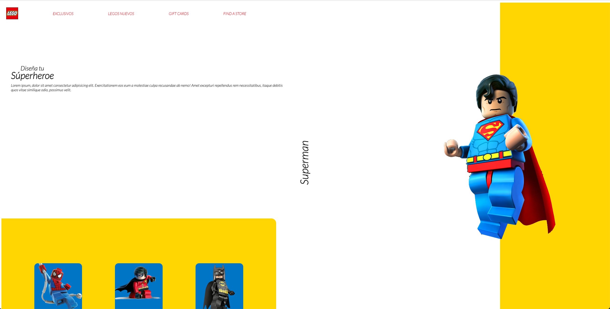

Landing Page Lego

En este repositorio esta un ejemplo de una landing page, con animaciones para el desplazamiento de las secciones pricipales del documento.

Para levantar el proyecto utiliza un servidor para despachar contenido estatico o usa la extension de Visual Studio Code Live Server

Stack: 
#HTML
#Vanilla Javascript
#CSS3

